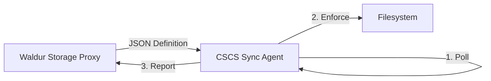

# CSCS Storage Synchronization Agent

This agent acts as the bridge between the **Waldur Storage Proxy** and the physical **HPC Storage Infrastructure**. It implements a "pull-based" synchronization pattern to ensure that Logical Resources defined in Waldur are accurately reflected in the physical filesystem quotas and permissions.

## 🏗 Architecture

This agent is designed to run on a **Storage Management Node** (a server with administrative mount access to the filesystems).



1. **Poll**: Fetches target resource state from the Proxy API.
2. **Enforce**: Creates directories (`mkdir`), sets permissions (`chown`/`chmod`), and applies limits.
3. **Report**: Sends lifecycle callbacks (e.g., `set_state_done`) back to Waldur to confirm provisioning.

## 🚀 Prerequisites

* **Operating System**: Linux (RHEL/AlmaLinux/Ubuntu)
* **Python**: 3.10 or higher
* **Package Manager**: [uv](https://github.com/astral-sh/uv) (recommended)
* **System Access**:
  * Root privileges (required for `chown` and `lfs setquota`).
  * `lfs` command line tools installed (if using Lustre).
  * Network access to the `waldur-storage-proxy`.

## 📦 Installation

We use `uv` for fast, reliable dependency management.

1. **Clone the repository:**

    ```bash
    git clone https://github.com/waldur/cscs-storage-sync.git
    cd cscs-storage-sync
    ```

2. **Install dependencies and create virtual environment:**

    ```bash
    uv sync
    ```

## ⚙️ Configuration

Create a `config.yaml` file in the root directory.

```yaml
# ------------------------------------------------------------------
# Connectivity
# ------------------------------------------------------------------
# The URL of the Waldur Storage Proxy API
proxy_url: "http://waldur-storage-proxy:8080/api/storage-resources/"

# Authentication Token for the Service Account (Used to authenticate with Proxy)
api_token: "eyJh..."

# ------------------------------------------------------------------
# Physical Storage
# ------------------------------------------------------------------
# The root mount point where 'capstor', 'vast', etc. are located
storage_root: "/mnt/lustre"

# Where to move directories when a resource is terminated in Waldur
archive_dir: "/mnt/lustre/.trash"

# Map Proxy 'storageSystem.key' to directory names on disk
system_mappings:
  capstor: "capstor"
  vast: "vast"
  iopsstor: "iopsstor"

# ------------------------------------------------------------------
# Safety & Tuning
# ------------------------------------------------------------------
# Polling frequency in seconds
sync_interval_seconds: 60

# Prevent chown operations on system GIDs (e.g., root, bin)
min_gid_allowed: 1000

# If true, logs commands (mkdir, lfs) but does not execute them
dry_run: false
```

## 🖥 Usage

### Development / Manual Run

To run the agent manually in the terminal:

```bash
# Using uv to run the script entry point
uv run cscs-sync
```

## 🛠 Development

### Formatting and Linting

We use `ruff` for code quality.

```bash
# Check for linting errors
uv run ruff check .

# Auto-fix format issues
uv run ruff format .
```

### Type Checking

We use `mypy` for static type analysis.

```bash
uv run mypy src
```

### Project Directory Structure

```text
cscs-storage-sync/
├── config.yaml            # Configuration
├── pyproject.toml         # Build & Dependency config
├── README.md              # Documentation
└── src/
    └── cscs_storage_sync/
        ├── __init__.py
        ├── main.py        # Entry point
        ├── api_client.py  # HTTP Client
        ├── filesystem.py  # OS operations
        ├── processors.py  # Business logic
        └── models.py      # Pydantic data schemas
```
